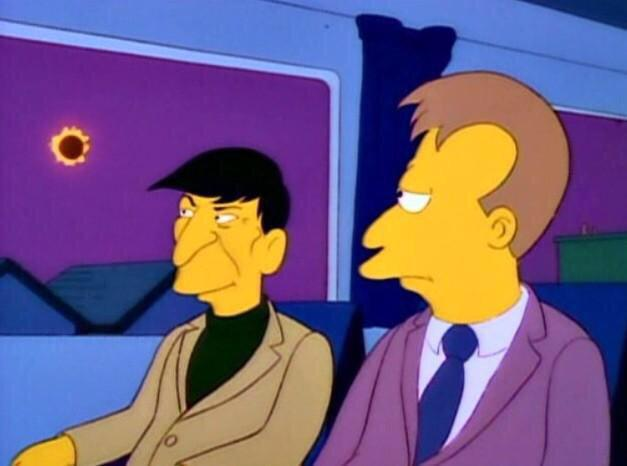
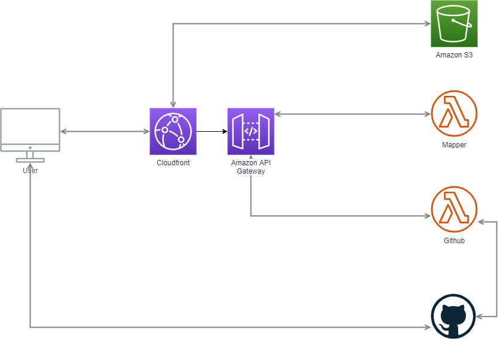

# The cosmic ballet... goes on

Now that we've seen what the application looks like, and how it's supposed to behave, let's discuss what type of architecture we might want to use.

## The Architecture

