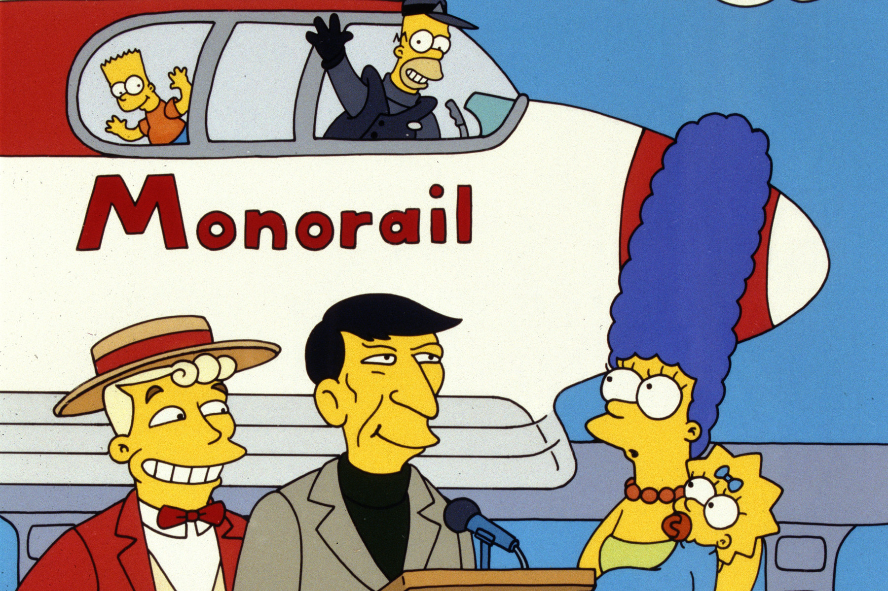
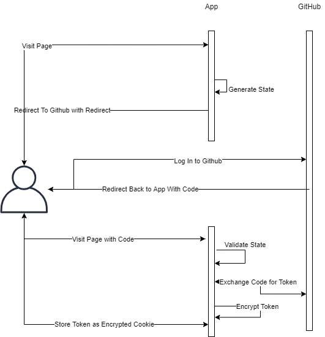

# I said Monorail!

### Our App

The app is very simple, it has 3 main responsibilities

1. Serve static content
1. Initiate Github OAuth Flow
1. Fetch users avatar and map to their Simpsons character

## The OAuth Flow

## The Architecture

